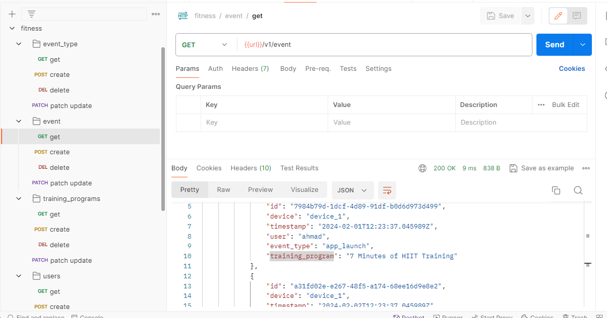

# FitnessApp (NEAR FIELD COMMUNICATION).

#### HOW TO SETUP ON LOCAL Development:

you need to install python =>3.10

#### create new env:

```shell
         # Create the project directory
        mkdir venv
        
        # Create a virtual environment to isolate our package dependencies locally
        python3 -m venv venv
        source venv/scripts/activate  # On Windows use `env\Scripts\activate`
        
        # Install requirements into the virtual environment
        pip install -r requirements.txt
        python3 manage.py makemigrations
        python3 manage.py migrate
        
        
```

create new file with the name  **.env file:**
and make sure to have all things critical in it

## Run the server

`python3 manage.py runserver`


-----

# Response class

This class unifies the responses for all the apis

Where every response should contain:

- data
- status
- message
- success
- pagination info ( if you enable pagination )

* If you want to paginate data you must call ```response.paginate( request, data)```, then
  call ```response.collect(status, message, data, is_paginte)```

    - status: ```it's value is ( 200, 400, 401, 404, 500, ... ) it's default value is 200```.
    - status: ```*string``` describe response ```it's default value empty```.
    - data: ```*array``` express the data you want to send with response
      ```default value is [] if you call response.paginate before response.collect```<br/>
      the data will be stored in the response instance automatically after the pagination process
    - is_paginated: ```*boolean``` if you want to show pagination data in the response, just
      send ```is_pagination=true default value is false```


### Project Structure 
```shell
fitness_training_project
---->micro_services
   ----> base # (this have base class api, baseresponse... ) 
   ----> fitness # (fitness service )
         ---->crons #(In order to send notifications in a scheduled and organized manner)
              ----> not_start_training_program_notification_cron # send notifications in not start program case
              ----> finishes_training_program_notification_cron # send notifications in finished program case
         ----> reposiories # (this handle apis and respose for fitness app )
              ----> event #: have event apis
                    ----> platform #: this in case we will have multi platforms in future (website, dahboard, mobile...)
                          ----> commom #: this have common apis and serializers between (website, dahboard, mobile...) 
                          ----> mobile: ...
                          ...
                          ...
                    ----> TDD # : this folder have TestCase for events in every platforms 
                      
              ----> event_type # : have event type apis
                    ...
                    ...
              ----> training_programs # : have training_programs api
                    ...
                    ...
    ----> users # (users service)
----> settings # (configration projects (database, apps, ...) )
----> urls #  content v1 urls
```


To run TDD
```shell
python manage.py test fitness fitness_training_project.micro_services.fitness.repositories.event.TDD.event_mobile_tdd
```
#### Run Crons
```shell
everytime you run the management command python manage.py runcrons all the crons will run if required. Depending on the application the management command can be called from the Unix crontab as often as required. Every 5 minutes usually works for most of my applications, for example:

python manage.py runcrons  "fitness_training_project.micro_services.fitness.crons.finishes_training_program_notification_cron.FinishesTrainingProgramNotificationCronJob",
python manage.py runcrons  "fitness_training_project.micro_services.fitness.crons.not_start_training_program_notification_cron.NotStartProgramNotificationCronJob",

```
##### POST MAN
